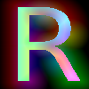
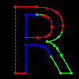

# MSDF

Go implementation of Multi-Channel Signed Distance Field generation for font rendering.

## What is MSDF?

MSDF encodes vector fonts as textures using RGB channels to preserve sharp corners and fine details.

## How it works

1. Parse font outlines into curves
2. Detect sharp corners and assign RGB colors
3. Calculate distances to colored segments for each pixel

## Example

| Character | MSDF Output | Debug View |
| --------- | ----------- | ---------- |
| **R**     |  |  |

## Usage

```go
package main

import (
    "fmt"
    msdf "github.com/moozd/msdf/pkg"
)

func main() {
    cfg := &msdf.Config{
        Scale: 0.5,
        Debug: true,  // Generate debug visualizations
    }

    generator, _ := msdf.New("/path/to/font.ttf", cfg)

    // Generate MSDF for character
    glyph := generator.Get('R')
    glyph.Save("assets/R.png")
}
```

## Features

- Scale-independent rendering
- Sharp corner preservation
- GPU-friendly
