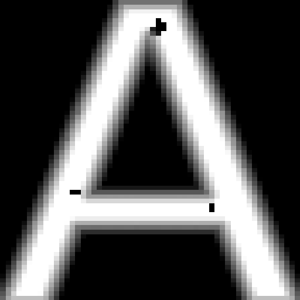
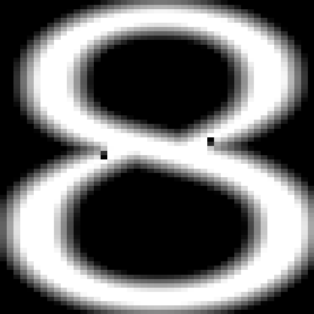
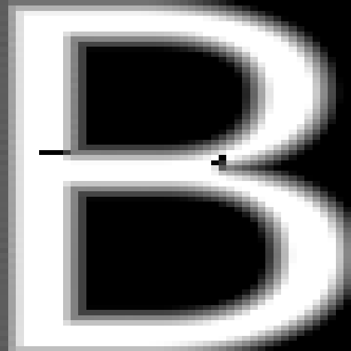
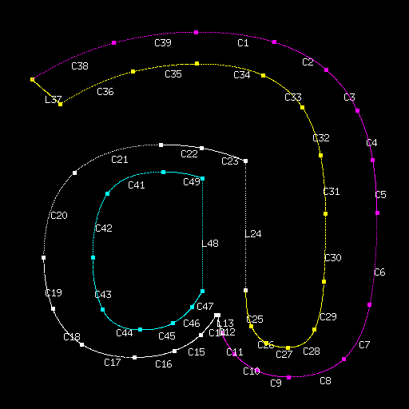
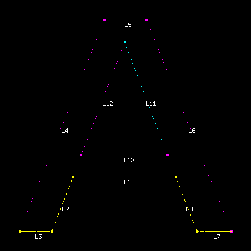
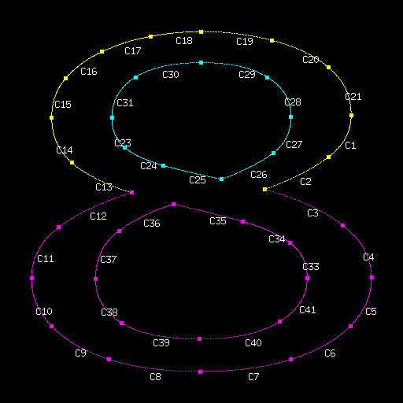
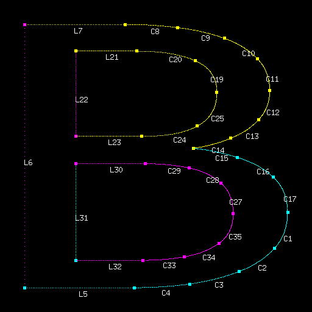
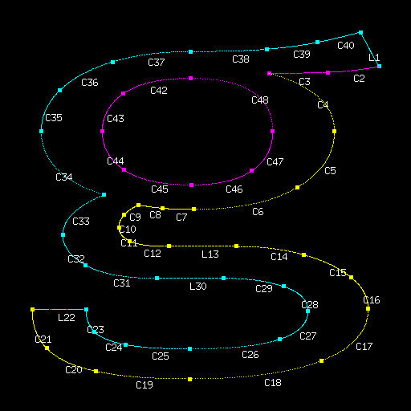
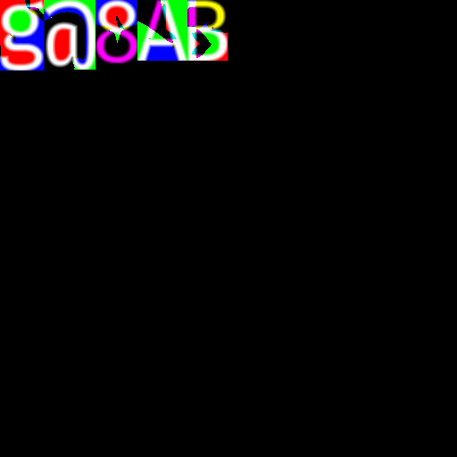

# MSDF

Go implementation of Multi-Channel Signed Distance Field generation for font rendering.

## What is MSDF?

MSDF encodes vector fonts as textures using RGB channels to preserve sharp corners and fine details.

## How it works

1. Parse font outlines into curves
2. Detect sharp corners and assign RGB colors
3. Calculate distances to colored segments for each pixel

## Assets

The `assets/` folder contains example outputs showcasing MSDF generation capabilities:

### Generated Characters
- **@, A, U, 8, B, g** - Individual character examples
- **atlas.png** - Combined texture atlas
- **atlas.json** - Atlas metadata and character mappings

### File Types
- `*_render.png` - Final rendered output showing smooth text rendering
- `*_debug.png` - Debug visualization showing edge coloring algorithm
- `atlas.*` - Multi-character texture atlas with JSON metadata

## Examples

### MSDF Textures and Rendered Output

| Character | Rendered Output                            |
| --------- | ------------------------------------------ |
| **@**     |  |
| **A**     |  |
| **8**     |  |
| **B**     |  |
| **g**     |  |

### Debug Visualizations (Edge Coloring)

| Character | Debug Visualization                        |
| --------- | ------------------------------------------ |
| **@**     |  |
| **A**     |  |
| **8**     |  |
| **B**     |  |
| **g**     |  |

### Atlas Generation



*Combined texture atlas containing multiple characters with optimized packing*

## Installation

### Build from Source

```bash
# Clone the repository
git clone https://github.com/moozd/msdf
cd msdf

# Build the binary
go build -o msdf cmd/msdf/main.go

# Or install globally
go install ./cmd/msdf
```

## Command Line Usage

Generate MSDF atlas for multiple characters:

```bash
# Basic atlas generation
./msdf -f /path/to/font.ttf -c "ABCabc123" -o ./assets

# With debug visualization
./msdf -f /path/to/font.ttf -c "Hello" -o ./assets --debug

# Custom settings
./msdf -f /path/to/font.ttf -c "@#$%" -o ./assets --scale 0.5 --seed 42 --size 48 --debug
```

### Command Options

- `-f, --font`: Path to font file (required)
- `-c, --charset`: Character set to generate (required)
- `-o, --output`: Output directory (default: current directory)
- `-s, --size`: Font size (default: 1.0)
- `-d, --debug`: Generate debug visualization showing edge coloring
- `--scale`: Texture scale factor (default: 1.0)
- `--seed`: Coloring seed for edge assignment (default: 0)
- `--distance-field`: Distance field range (default: 4.0)

### Output Files

The command generates:
- `atlas.png` - Combined texture atlas containing all characters
- `atlas.json` - Metadata file with character positions and metrics
- `*_debug.png` - Individual debug visualizations (when `--debug` is used)
- `*_render.png` - Individual rendered outputs (when `--debug` is used)

## Library Usage

```go
package main

import (
    "fmt"
    msdf "github.com/moozd/msdf/pkg"
)

func main() {
    cfg := &msdf.Config{
        Scale: 0.5,
        Debug: true,  // Generate debug visualizations
    }

    generator, _ := msdf.New("/path/to/font.ttf", cfg)

    // Generate MSDF for character
    glyph := generator.Get('R')
    glyph.Save("assets/R.png")
}
```

## Development

### Running Tests

```bash
# Run all tests
go test ./...

# Run tests with verbose output
go test -v ./...

# Run specific package tests
go test ./pkg
```

### Building

```bash
# Build for current platform
go build -o msdf cmd/msdf/main.go

# Build with optimizations for release
go build -ldflags="-s -w" -o msdf cmd/msdf/main.go

# Cross-compile for different platforms
GOOS=windows GOARCH=amd64 go build -o msdf.exe cmd/msdf/main.go
GOOS=darwin GOARCH=amd64 go build -o msdf-mac cmd/msdf/main.go
```

### Dependencies

```bash
# Download dependencies
go mod download

# Update dependencies
go mod tidy

# Verify dependencies
go mod verify
```

## Features

- Scale-independent rendering
- Sharp corner preservation  
- GPU-friendly texture output
- Atlas generation for multiple characters
- Debug visualization for edge coloring analysis
- Configurable distance field parameters
