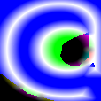
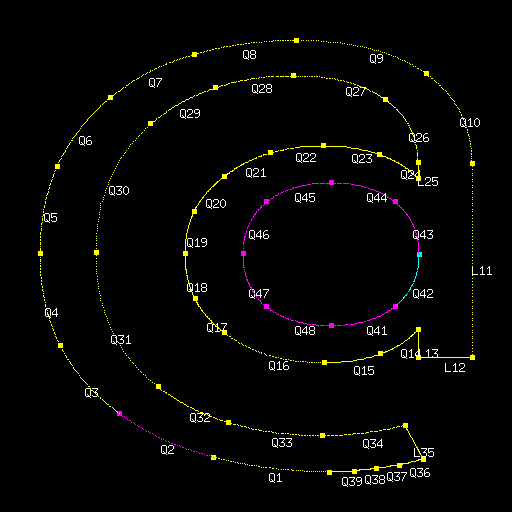

# MSDF - Multi-Channel Signed Distance Field Generator

A Go implementation of Multi-Channel Signed Distance Field (MSDF) generation for high-quality font rendering at any scale.

## What is MSDF?

MSDF (Multi-Channel Signed Distance Field) is an advanced technique for storing and rendering vector fonts as textures. Unlike traditional bitmap fonts or single-channel SDF, MSDF preserves sharp corners and fine details by encoding distance information in RGB channels, with each channel representing distance to differently colored contour segments.

## Algorithm Overview

### 1. Contour Decomposition

The algorithm starts by parsing font outlines into mathematical curves (lines, quadratic Bézier, cubic Bézier) and organizing them into closed contours.

### 2. Corner Detection & Edge Coloring

Sharp corners in the glyph outline are detected using angle thresholds. The three sharpest corners determine where to switch between RGB color channels, ensuring that problematic areas (sharp corners) have multiple distance measurements available.

### 3. Distance Field Generation

For each pixel in the output texture:

- **Distance Calculation**: Find minimum distance to each color channel's curve segments
- **Winding Number**: Cast a ray to determine if the pixel is inside or outside the glyph
- **Sign Assignment**: Negative distances for inside, positive for outside
- **Encoding**: Store RGB distances in corresponding color channels

## Examples

### Basic Character Generation

| Character | MSDF Output               | Debug Visualization            |
| --------- | ------------------------- | ------------------------------ |
| **A**     |         |  |
| **R**     |         |  |
| **@**     |  |  |
| **C**     |         |  |
| **B**     |         |  |

### Debug Visualizations Explained

The debug images show the contour decomposition and edge coloring:

- **Red curves**: Segments assigned to the red channel
- **Green curves**: Segments assigned to the green channel
- **Blue curves**: Segments assigned to the blue channel
- **Color transitions**: Occur at the three sharpest detected corners
- **Contour direction**: All curves follow consistent winding direction

### Edge Coloring Strategy

The algorithm identifies sharp corners using angle measurements between adjacent curves:

1. **Corner Detection**: Calculate angles between consecutive curve segments
2. **Priority Ranking**: Sort corners by sharpness (smaller angles = sharper corners)
3. **Color Assignment**: Place the three sharpest corners as RGB transition points
4. **Channel Distribution**: Distribute remaining curve segments cyclically among RGB channels

This ensures that sharp corners—where traditional SDF methods fail—have multiple distance measurements available for accurate reconstruction.

## Distance Field Encoding

Each pixel in the final MSDF texture encodes:

- **Red Channel**: Distance to red-colored curve segments
- **Green Channel**: Distance to green-colored curve segments
- **Blue Channel**: Distance to blue-colored curve segments
- **Value 128**: Zero distance (exactly on the contour)
- **< 128**: Inside the glyph (negative distance)
- **> 128**: Outside the glyph (positive distance)

## Usage

```go
package main

import (
    "fmt"
    msdf "github.com/moozd/msdf/pkg"
)

func main() {
    cfg := &msdf.Config{
        LineHeight: 512,
        Advance:    512,
        Debug:      true,  // Generate debug visualizations
    }

    generator, _ := msdf.New("/path/to/font.ttf", cfg)

    // Generate MSDF for character 'A'
    glyph := generator.Get('A')
    glyph.Save("A.png")
}
```

## Advantages over Traditional Methods

- **Scale Independence**: Crisp rendering at any size
- **Sharp Corner Preservation**: Multiple distance channels prevent corner rounding
- **Memory Efficient**: Single texture supports all font sizes
- **GPU Friendly**: Simple shader-based reconstruction
- **Artifact Reduction**: Superior to single-channel SDF for complex glyphs

## Implementation Status

- ✅ Font parsing and curve extraction
- ✅ Contour detection and organization
- ✅ Corner detection and sharpness ranking
- ✅ Multi-channel edge coloring
- ✅ Winding number calculation
- ✅ Distance field generation
- ✅ Debug visualization output
- 🚧 Analytical distance calculations (currently using sampling)
- ⏳ GPU shader examples
- ⏳ Runtime font rendering integration
