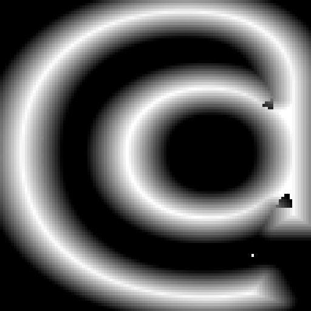
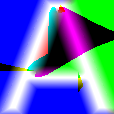
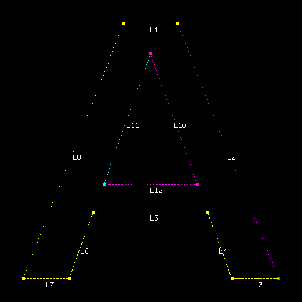

# MSDF

Go implementation of Multi-Channel Signed Distance Field generation for font rendering.

## What is MSDF?

MSDF encodes vector fonts as textures using RGB channels to preserve sharp corners and fine details.

## How it works

1. Parse font outlines into curves
2. Detect sharp corners and assign RGB colors
3. Calculate distances to colored segments for each pixel

## Example

### MSDF Texture and Rendered Output

| Character | MSDF Texture                        | Rendered Output                            |
| --------- | ----------------------------------- | ------------------------------------------ |
| **@**     |  |  |
| **A**     |  |  |
| **U**     |  |  |

### Debug Visualizations

| Character | Edge Coloring (WIP)                        |
| --------- | ------------------------------------------ |
| **@**     |  |
| **A**     |  |
| **U**     |  |

## Command Line Usage

Generate MSDF texture for a single character:

```bash
# Basic usage
msdf glyph -f /path/to/font.ttf -c A -o ./assets

# With debug visualization
msdf glyph -f /path/to/font.ttf -c A -o ./assets --debug

# With custom scale and seed
msdf glyph -f /path/to/font.ttf -c @ -o ./assets --scale 0.5 --seed 42 --debug
```

### Command Options

- `-f, --font`: Path to font file (required)
- `-c, --char`: Character to generate (required)
- `-o, --out`: Output directory (default: current directory)
- `-d, --debug`: Generate debug visualization showing edge coloring
- `--scale`: Texture scale factor (default: 1.0)
- `--seed`: Coloring seed for edge assignment (default: 0)

## Library Usage

```go
package main

import (
    "fmt"
    msdf "github.com/moozd/msdf/pkg"
)

func main() {
    cfg := &msdf.Config{
        Scale: 0.5,
        Debug: true,  // Generate debug visualizations
    }

    generator, _ := msdf.New("/path/to/font.ttf", cfg)

    // Generate MSDF for character
    glyph := generator.Get('R')
    glyph.Save("assets/R.png")
}
```

## Features

- Scale-independent rendering
- Sharp corner preservation
- GPU-friendly
